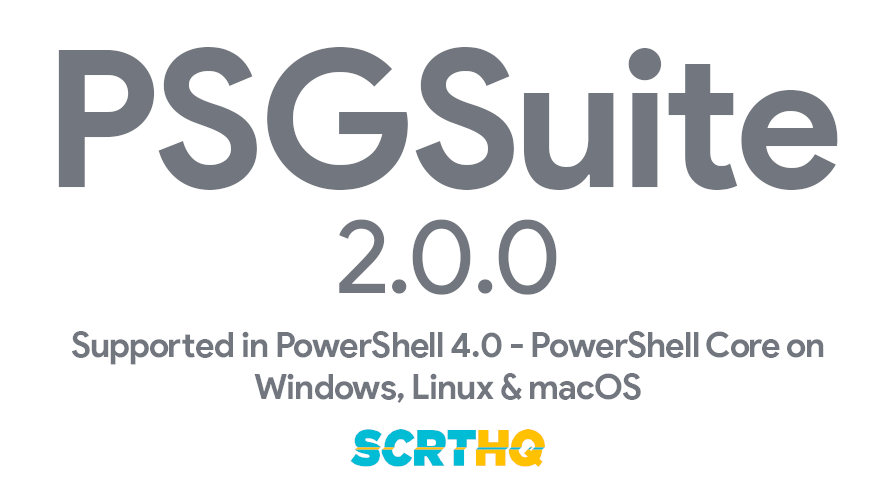

# PSGSuite
<div align="center">

</br>
</br>
  <!-- Azure Pipelines -->
  <a href="https://dev.azure.com/scrthq/SCRT%20HQ/_build/latest?definitionId=2">
    
  </a>&nbsp;&nbsp;&nbsp;&nbsp;
  <!-- PS Gallery -->
  <a href="https://www.PowerShellGallery.com/packages/PSGSuite">
    
  </a>&nbsp;&nbsp;&nbsp;&nbsp;
  <!-- Gitter -->
  <a href="https://gitter.im/PSGSuite/Lobby?utm_source=badge&utm_medium=badge&utm_campaign=pr-badge&utm_content=badge">
    
  </a>&nbsp;&nbsp;&nbsp;&nbsp;
  <!-- Slack -->
  <a href="https://scrthq-slack-invite.herokuapp.com/">
    
  </a>
</div>
<br />

***

## Documentation

Check out the [GitHub wiki for PSGSuite](https://github.com/scrthq/PSGSuite/wiki) for help with setting up as well as full function help!

## Contributing

Interested in helping out with PSGSuite development? Please check out our [Contribution Guidelines](https://github.com/scrthq/PSGSuite/blob/master/CONTRIBUTING.md)!

## Code of Conduct

Please adhere to our [Code of Conduct](https://github.com/scrthq/PSGSuite/blob/master/CODE_OF_CONDUCT.md) when interacting with this repo.

## License

[Apache 2.0](https://tldrlegal.com/license/apache-license-2.0-(apache-2.0))

## Changelog

[Full CHANGELOG here](https://github.com/scrthq/PSGSuite/blob/master/CHANGELOG.md)

***

## 2.0.0 - Changes

### New Functionality

* PowerShell Core support for cross-platform functionality
* P12 Keys (service accounts) _and_ client_secrets.json (OAuth) are both now supported
* All Drive functions now support Team Drives
* Get-GSGmailMessage can now save message attachments to a local path
* File uploads to Drive are now supported (including recursive folder uploads!)

### Breaking Changes in 2.0.0

#### Gmail Delegation Management Removed

~~The Gmail API does not yet support handling inbox delegation. The functionality addition has been pushed back again until Q3 of 2018. Once the Gmail API supports inbox delegation, those functions will be added.~~

**Delegation functions have been re-added to PSGSuite as of v2.4.0! Update now to get all the goodness of v2 + delegation commands!**

#### Functions Removed

Please note that not all functions were ported to PSGSuite 2.0.0 due to restrictions within the .NET SDK and deprecated API calls. Here is the list of functions no longer existing in PSGSuite as of 2.0.0:

* Get-GSToken: no need for this as the keys are being consumed by Googles Auth SDK directly now, which makes Access/Refresh tokens non-existent for P12 Key service accounts and token management is handled automatically
* Revoke-GSToken: same here, no longer needed due to auth service changes
* Start-PSGSuiteConfigWizard: no longer supported as WPF is not compatible outside of Windows


#### Functions Aliased

All other functions are either intact or have an alias included to support backwards compatibility in scripts. Full list of aliases:

```
Alias                             Maps To
-----                             -------
Add-GSDriveFilePermissions        Add-GSDrivePermission
Export-PSGSuiteConfiguration      Set-PSGSuiteConfig
Get-GSCalendarResourceList        Get-GSResourceList
Get-GSDataTransferApplicationList Get-GSDataTransferApplication
Get-GSDriveFileInfo               Get-GSDriveFile
Get-GSDriveFilePermissionsList    Get-GSDrivePermission
Get-GSGmailFilterList             Get-GSGmailFilter
Get-GSGmailLabelList              Get-GSGmailLabel
Get-GSGmailMessageInfo            Get-GmailMessage
Get-GSGroupList                   Get-GSGroup
Get-GSGroupMemberList             Get-GSGroupMember
Get-GSMobileDeviceList            Get-GSMobileDevice
Get-GSOrganizationalUnitList      Get-GSOrganizationalUnit
Get-GSOrgUnit                     Get-GSOrganizationalUnit
Get-GSOrgUnitList                 Get-GSOrganizationalUnit
Get-GSOU                          Get-GSOrganizationalUnit
Get-GSResourceList                Get-GSResource
Get-GSShortURLInfo                Get-GSShortURL
Get-GSTeamDrivesList              Get-GSTeamDrive
Get-GSUserASPList                 Get-GSUserASP
Get-GSUserLicenseInfo             Get-GSUserLicense
Get-GSUserLicenseList             Get-GSUserLicense
Get-GSUserList                    Get-GSUser
Get-GSUserSchemaInfo              Get-GSUserSchema
Get-GSUserSchemaList              Get-GSUserSchema
Get-GSUserTokenList               Get-GSUserToken
Import-PSGSuiteConfiguration      Get-PSGSuiteConfig
Move-GSGmailMessageToTrash        Remove-GSGmailMessage
New-GSCalendarResource            New-GSResource
Remove-GSGmailMessageFromTrash    Restore-GSGmailMessage
Set-PSGSuiteDefaultDomain         Switch-PSGSuiteConfig
Switch-PSGSuiteDomain             Switch-PSGSuiteConfig
Update-GSCalendarResource         Update-GSResource
Update-GSSheetValue               Export-GSSheet
```

### Most recent changes

#### 2.17.3

* [Issue #87](https://github.com/scrthq/PSGSuite/issues/87)
  * Added: `Get-GSCourseParticipant` and `Get-GSClassroomUserProfile` now have the `Fields` parameter
* [Issue #53](https://github.com/scrthq/PSGSuite/issues/53)
  * Added Get-GSContactList
  * Added Remove-GSContact
* Other additions
  * Added Remove-GSCalendarEvent
  * Added New-GSGmailLabel
  * Added Remmove-GSGmailLabel

#### 2.17.2

* [Issue #103](https://github.com/scrthq/PSGSuite/issues/103)
  * Fixed: `SendNotificationEmail` is now correctly defaulting to `$false`, but attempting to actually send the notification email results in an error. This is now corrected.

#### 2.17.1

* Validated deployment via Azure Pipelines

#### 2.17.0

* [Issue #102](https://github.com/scrthq/PSGSuite/issues/102)
  * Fixed: `$EncryptionKey` PSM1 parameter now stores the AES key correctly so SecureStrings are encrypted/decrypted as intended.
* [Issue #103](https://github.com/scrthq/PSGSuite/issues/103)
  * Updated: `SendNotificationEmail` parameter on `Add-GSDrivePermission` defaults to false for all User & Group permissions that are not ownership transfers.
  * Updated: Documentation for `SendNotificationEmail` parameter on `Add-GSDrivePermission` for clarity towards default Google API parameter values.
* Moved: `Get-GSToken` and `New-GoogleService` to Public functions under the Authentication section
* Added: More unit testing for `Get-GSUser`
* Updated: `psake` build script

#### 2.16.1

- Fixed: Module deployment segment in psake script deploying decompiled/broken module

#### 2.16.0

- Updated: Build script to compile module into a single PSM1 file for cleanliness and loading speed improvements

#### 2.15.4

* [Issue #96](https://github.com/scrthq/PSGSuite/issues/96)
  * Updated the following on `Get-GSGroup`:
    * Set default scope to `Customer` so that getting the list of groups expectedly gets all of them, not just the ones in your primary domain
    * Added `Domain` parameter to specify which domain to list groups from your customer account
    * Added `Filter` parameter to only list groups matching the Group query syntax
    * Moved the `Get-GSGroupListPrivate` private function into the body of `Get-GSGroup` for error clarity
* Others:
  * Moved the `Get-GSUserListPrivate` private function into the body of `Get-GSUser` for error clarity
  * Improved error handling for User and Message List functions when there are no results.

#### 2.15.3

* [Issue #87](https://github.com/scrthq/PSGSuite/issues/87)
  * Fixed `Add-GSCourseParticipant` error: `"Cannot convert the "student@uni.edu" value of type "System.String" to type "Google.Apis.Classroom.v1.Data.Student"."`
  * Set `$request.Fields = "*"` for `Get-GSCourseParticipant` and `Get-GSClassroomUserProfile` to return all available fields for the `Profile`, including `EmailAddress`
* [Issue #93](https://github.com/scrthq/PSGSuite/issues/93)
  * Added: `MaxToModify` parameter to `Remove-GSGmailMessage` and `Update-GSGmailMessageLabels` in the `Filter` parameter set to prevent removing/updating more messages than expected when using a filter to gather the list of messages to update.
* Added: `Id` alias for `User` parameter on `Get-GSUser` for better pipeline support

#### 2.15.2

* [Pull Request #94](https://github.com/scrthq/PSGSuite/pull/94) **Thanks, [@dwrusse](https://github.com/dwrusse)!**
  * Added `Update-GSGmailLabel` to enable updating of Gmail label properties
  * Added `Update-GSGmailMessageLabel` enable updating of labels attached to Gmail messages
* [Issue #93](https://github.com/scrthq/PSGSuite/issues/93)
  * Updated `Remove-GSGmailMessage` to include a `-Filter` parameter to allow removal of messages matching a filter in a single command
  * Improved pipeline support for `Remove-GSGmailMessage`

#### 2.15.1

* [Issue #87](https://github.com/scrthq/PSGSuite/issues/87)
  * Added `User` parameter to all Classroom functions to specify which user to authenticate the request as
* [Issue #90](https://github.com/scrthq/PSGSuite/issues/90)
  * Added `Update-GSUserPhoto`
  * Added `Remove-GSUserPhoto`

#### 2.15.0

* Updated Gmail Delegation functions to use the .NET SDK after Google announced delegation support for the Gmail API
* Cleaned up `Get-GSGmailDelegates` by removing the trailing `s` (now `Get-GSGmailDelegate`). Added the original function as an alias to the new function for backwards compatibility with scripts.
* Removed the `Raw` parameter from `Get-GSGmailDelegate` since it's no longer applicable.
* Enabled `Get-GSGmailDelegate` to perform both Get and List requests (previously only performed List requests)

#### 2.14.1

* [Issue #87](https://github.com/scrthq/PSGSuite/issues/87)
  * Removed `Add-Member` calls from `Get-GSCourseParticipant` to resolve item 3 on issue
  * Cleaned up `CourseStates` parameter on `Get-GSCourse` to validate against the Enum directly and removed the default parameter value to resolve item 2 on issue
  * Cleaned up `State` parameter on `Get-GSStudentGuardianInvitation` to validate against the Enum directly in an effort to prevent the same issue as item 2

#### 2.14.0

* [Issue #85](https://github.com/scrthq/PSGSuite/issues/85)
  * Added Google Classroom support with the following functions:
    * `Add-GSCourseParticipant`
    * `Confirm-GSCourseInvitation`
    * `Get-GSClassroomUserProfile`
    * `Get-GSCourse`
    * `Get-GSCourseAlias`
    * `Get-GSCourseInvitation`
    * `Get-GSCourseParticipant`
    * `Get-GSStudentGuardian`
    * `Get-GSStudentGuardianInvitation`
    * `New-GSCourse`
    * `New-GSCourseAlias`
    * `New-GSCourseInvitation`
    * `New-GSStudentGuardianInvitation`
    * `Remove-GSCourse`
    * `Remove-GSCourseAlias`
    * `Remove-GSCourseInvitation`
    * `Remove-GSCourseParticipant`
    * `Remove-GSStudentGuardian`
    * `Update-GSCourse`
* Fixed: `Get-GSToken` Create/Expiry time split issue on macOS caused by difference in `-UFormat %s` (macOS doesn't have trailing milliseconds)
* Fixed: Logic in confirming if UserID is `[decimal]` to prevent unnecessary errors
