# Google Cloud Configuration

## Overview

Depending on your account type, please click on the appropriate link below to begin the Google Cloud Project creation:

<!-- no toc -->
* [Google Workspace Super Admin](#project-creation-super-admin)
* [Google Workspace User or Google Personal Account](#project-creation-user-or-personal-account)

!!! info
    If **you are not** a Google Workspace Super Admin, the APIs you can enable are limited.

    * Google Workspace Super Admins: Admin SDK, Drive Activity, Enterprise License Manager, Gmail, Google Calendar, Google Chat, Google Classroom, Google Docs, Google Drive, Google Sheets, Google Slides, Google Tasks, Groups Settings, and People API.

    * Google Workspace Users or Google Personal Accounts: Contacts, Gmail, Google Calendar, Google Docs, Google Drive, Google Sheets, Google Slides, People, and Tasks API.

!!! warning
    If you are a Google Workspace Standard user, you **must** have the `Project Creator` role assigned to your user account by a Google Workspace Super Admin. If you do not have this role, you will receive an error similar to:

    ```
    You may not have permission to create projects in this organization.
    Contact your Google Apps account admin to verify you have the Project Creator role.
    ```

***

## Project Creation Super Admin

1. Follow this [link](https://console.developers.google.com/flows/enableapi?apiid=admin.googleapis.com,calendar-json.googleapis.com,chat.googleapis.com,classroom.googleapis.com,docs.googleapis.com,drive.googleapis.com,driveactivity.googleapis.com,licensing.googleapis.com,gmail.googleapis.com,groupssettings.googleapis.com,people.googleapis.com,sheets.googleapis.com,slides.googleapis.com,tasks.googleapis.com) to create or edit an existing project and enable all applicable APIs.
    1. If creating a new project for the very first time, click on `Create Project`.
        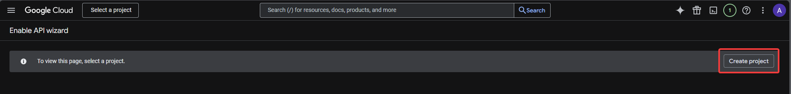
    1. If you have existing projects, make sure to select the correct project from the dropdown menu or create a new one.
        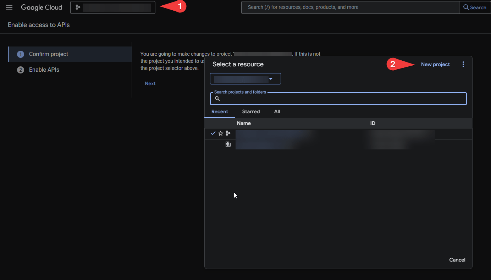

1. On the `New Project` page:
    1. Give your project a meaningful name, e.g. `PSGSuite Powershell Module`.
    1. Click `Create`.

    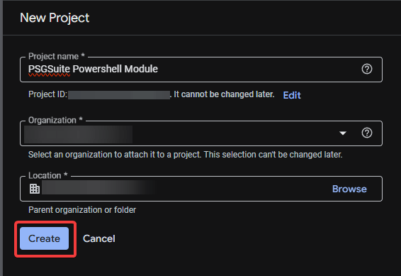

1. On the `Enable access to APIs` page:
    1. On the `Confirm Project` page, click `Next`
        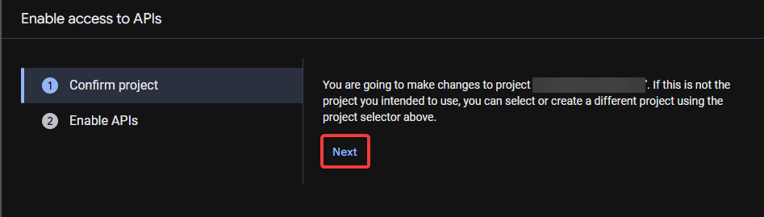
    1. On the `Enable APIs` page:
            1. Review the APIs that will be enabled for your project and click `Enable`.
        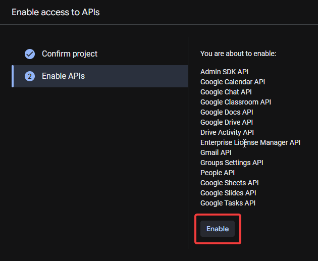

***

## Project Creation User or Personal Account

1. Follow this [link](https://console.developers.google.com/flows/enableapi?apiid=calendar-json.googleapis.com,docs.googleapis.com,drive.googleapis.com,gmail.googleapis.com,people.googleapis.com,sheets.googleapis.com,slides.googleapis.com,tasks.googleapis.com) to create or edit an existing project and enable all applicable APIs.
    1. If creating a new project for the very first time, click on `Create Project`.
        
    1. If you have existing projects, make sure to select the correct project from the dropdown menu or create a new one.
        

1. On the `New Project` page:
    * Give your project a meaningful name, e.g. `PSGSuite Powershell Module`.
    * Click `Create`.

    

1. On the `Enable access to APIs` page:
    1. On the `Confirm Project` page, click `Next`
        
    1. On the `Enable APIs` page:
          1. Review the APIs that will be enabled for your project and click `Enable`.
        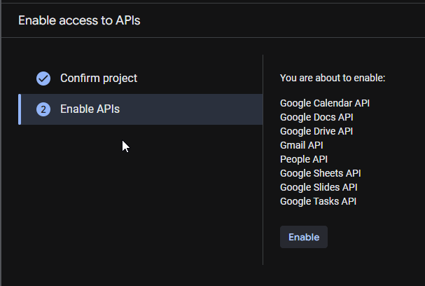

***

## Credentials

1. Navigate to [Credentials](https://console.cloud.google.com/apis/credentials)
1. Click on `Create Credentials`
1. Choose one of the credential types depending on your needs:
    * [OAuth 2.0 Client ID](#oauth-20)
    * [Service Account](#service-account)

!!! tip
    For Super Admins, it is recommended to use the Service Account method

    For Users or Personal Accounts, it is recommended to use the OAuth 2.0 Client ID method.

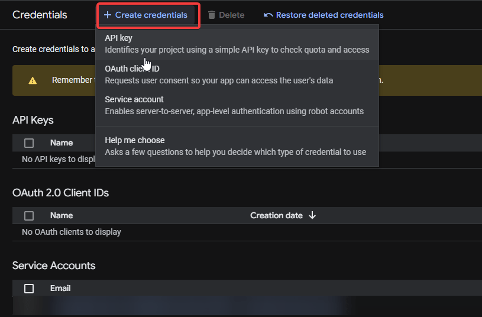

### OAuth 2.0

#### OAuth Consent Screen

Before setting up OAuth 2.0 credentials, you need to set up the OAuth consent screen. The consent screen is what the user will see when they are asked to authorize your application to access the data associated with the enabled APIs.

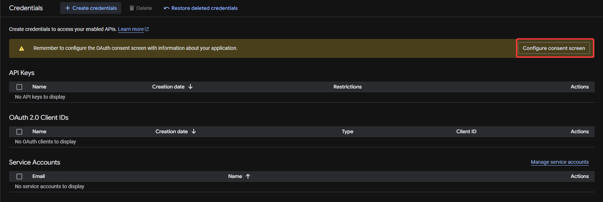

1. On the `OAuth Overview` page click `Get Started`
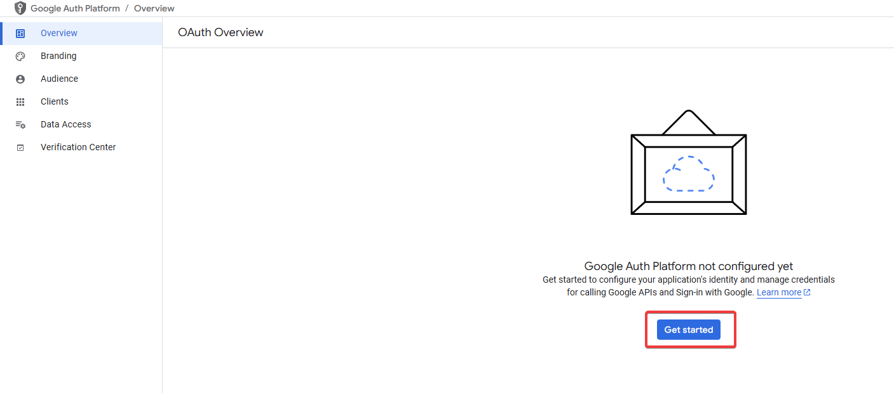

1. On the `Project Configuration` page:
    1. Under `App Information`:
        1. On the `App name` field, give your app a meaningful name, e.g. `PSGSuite Powershell Module`.
        1. On the `User support email` field, enter your email address.
        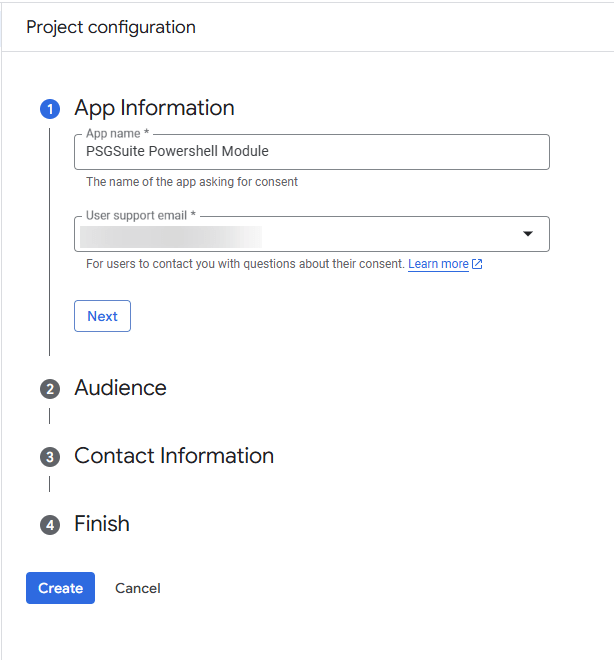
    1. Under `Audience`:
        1. If using Google Workspace, select `Internal`.
        1. If using a Google Personal Account, select `External`.
    1. Under `Contact Information`, enter your email address.
    1. Under `Finish`, check the box next to `I agree to the Google API Services User Data Policy`.
    1. Click `Continue` and click `Create`
    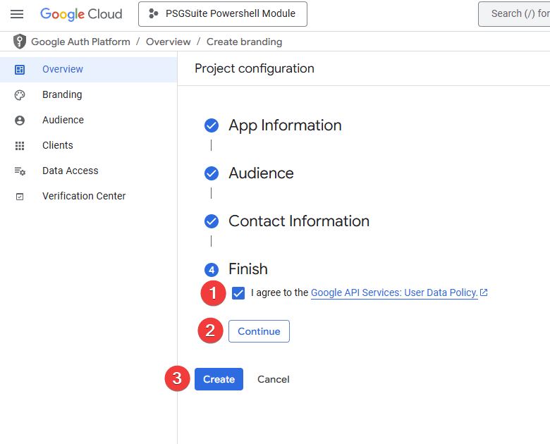

#### OAuth 2.0 Audience For External Apps

1. Navigate to [OAuth Overview](https://console.cloud.google.com/auth/overview)
1. Click on `Audience`
1. You have two options:
    1. Publish your app
        1. If you choose, to publish your app anyone can use it.
    1. Leave your app as `Testing`
        1. If you choose to leave your app as `Testing`, you will need to add users to the `Test Users` list.

!!! warning
    Be aware of some of the limitations of an `External` application that is under `Testing` mode.

    The refresh token will expire after 7 days.

    If you want to have a non-expiring refresh token, you need to publish your application or use an `Internal` application.

#### OAuth 2.0 Credentials

1. Navigate to [Credentials](https://console.cloud.google.com/apis/credentials)
1. Click on `Create Credentials`
1. Choose `OAuth client ID`
1. On the `Create OAuth client ID` page:
    1. Under the `Application type` dropdown, select `Desktop App`
        1. Under `Name`, give your OAuth client ID a meaningful name, e.g. `PSGSuite Powershell Module OAuth Credentials`.
        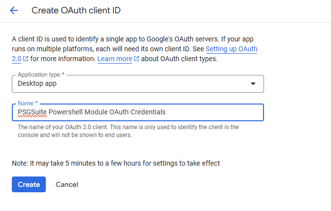
    1. Click `Create`.
1. On the `OAuth client created` pop-up, download the JSON file and save it to a location on your computer. You will need the path where you saved the JSON file later on.
    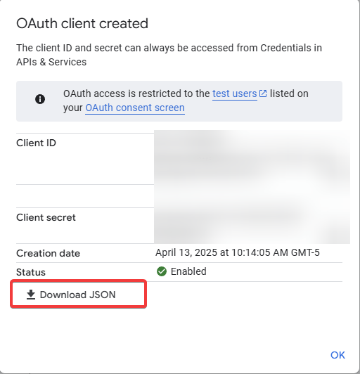
1. [You can now begin configuring the module](../configuration/module_configuration.md)

***

### Service Account

1. On the `Create service account` page:
    1. Under `Service Account Details`:
        1. On the `Service account name` field, give your service a meaningful name, e.g. `svc_psgsuite_pwsh_module`.
            1. (Optional) On the `Service account description` field, give your service a meaningful description, e.g. `PSGSuite PowerShell Module Service Account`.
        1. Click on `Create and continue`.
       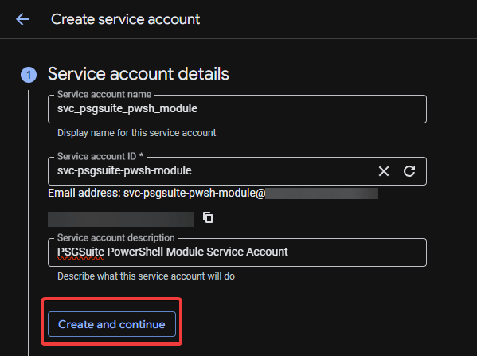
    1. Under `Grant this service account access to project (optional)`:
        1. Click on `Select a role` dropdown menu.
        1. Select --> `Project` --> `Owner`
        1. Click on `Continue`.
       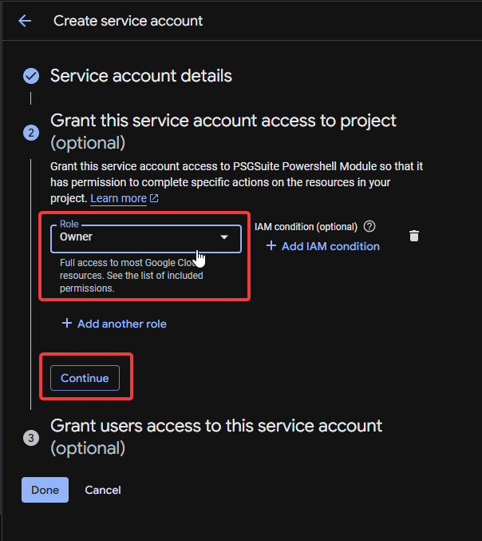
    1. Under `Grant users access to this service account (optional)`:
    1. If you want to grant users access to this service account, you can do so here. Otherwise, you can skip this step.
    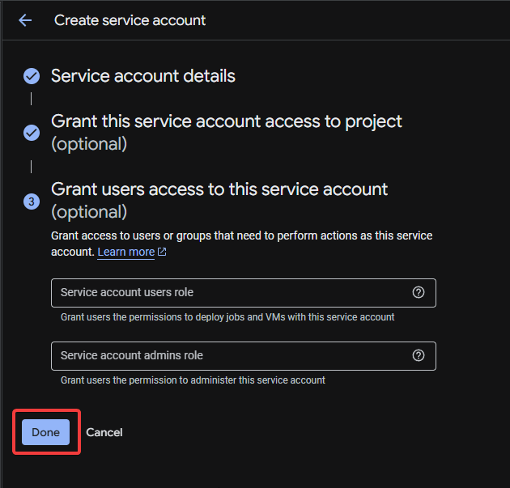
1. On the `Credentials` page:
    1. Under the `Actions` column, click on the pencil icon to edit the service account you just created.
    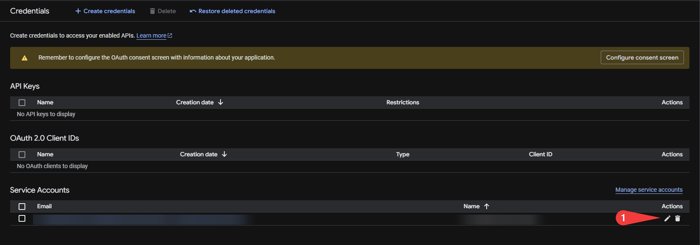
    1. Select `Keys`.
    1. Click on `Add Key` and select `Create new key`.
    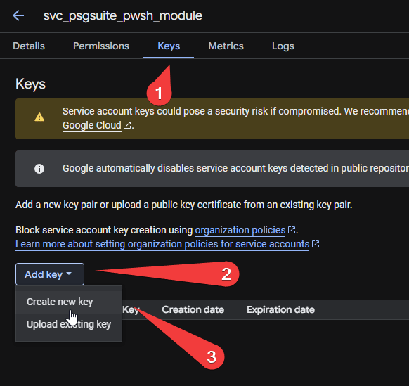
    1. Select `P12` and click `Create`
    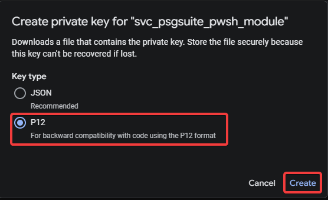
    1. Save the key to a location on your computer. You will need the path where you saved the key later on.
    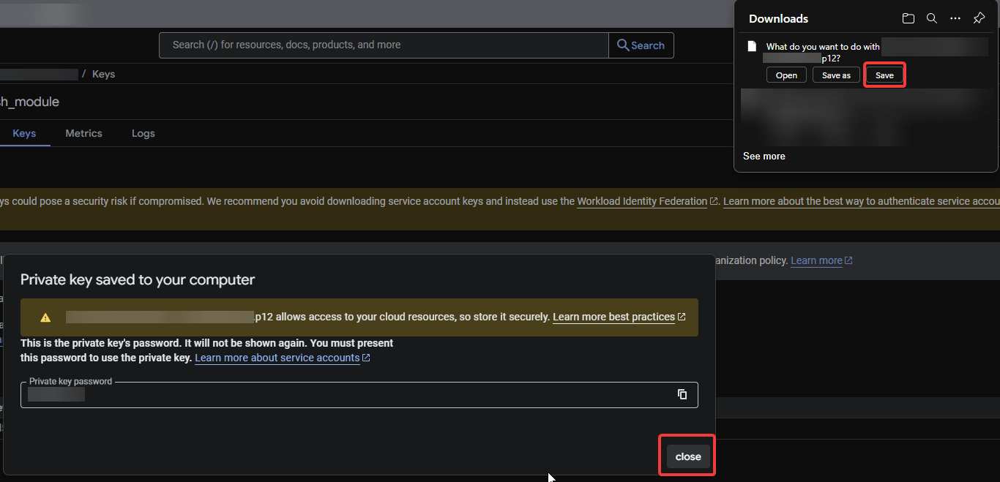

#### Domain Wide Delegation

In order for the service account to impersonate one or more users in your domain, you need to enable domain-wide delegation.

1. On the `Credentials` page:
    1. Under the `Actions` column, click on the pencil icon to edit the service account you just created.
    
1. On the `Details` tab, expand `Advanced Settings`:
    1. Copy your `Client ID`
    1. Click on `View Google Workspace Admin Console`
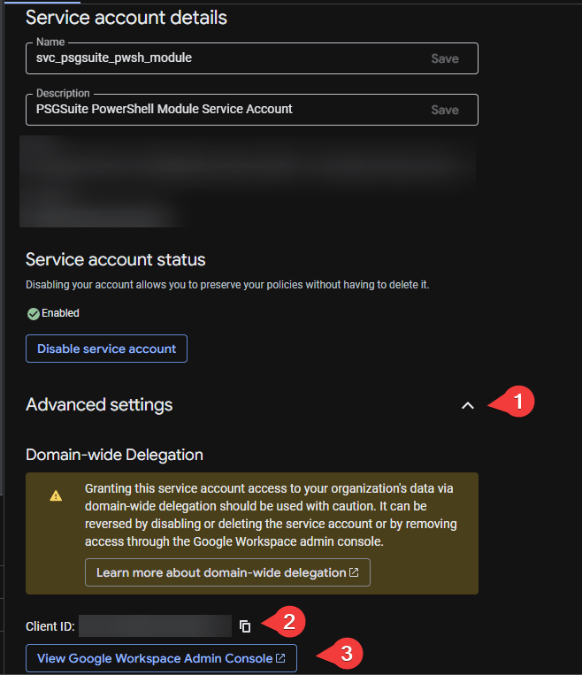
1. On the `Google Admin Console` page, navigate to `Security` --> `Access and data control` --> `API Controls` --> `Manage Domain Wide Delegation`
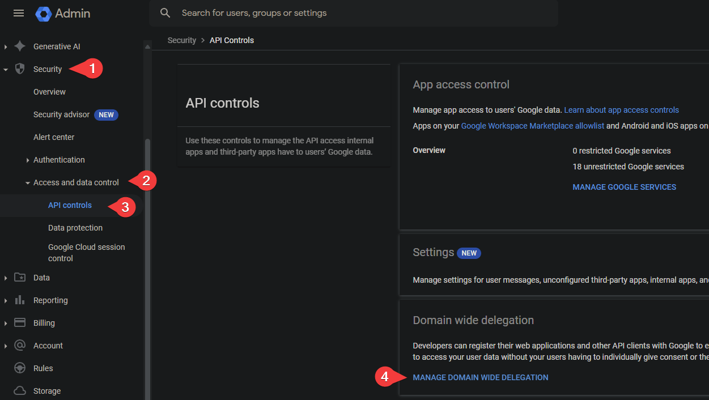
1. On the `Domain-wide Delegation` page, click  on `Add new`
    1. Paste your client ID from step 2.2 into the `Client ID` field.
    1. Copy/paste the OAuth scopes below into the `OAuth Scopes` field and click `Authorize`
        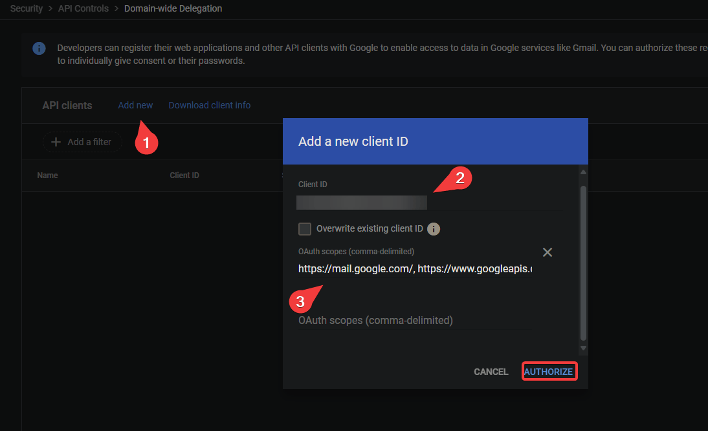
    !!! info
        Although the module does not use **all** of these scopes currently, additional functions are being built to leverage this entire list.
        If for security reasons you want to limit the scopes, please remove the ones you do not need.

    ```plaintext {linenums="1"}
    https://mail.google.com/,
    https://www.googleapis.com/auth/activity,
    https://www.googleapis.com/auth/admin.datatransfer,
    https://www.googleapis.com/auth/admin.directory.customer,
    https://www.googleapis.com/auth/admin.directory.device.chromeos,
    https://www.googleapis.com/auth/admin.directory.device.mobile,
    https://www.googleapis.com/auth/admin.directory.domain,
    https://www.googleapis.com/auth/admin.directory.group,
    https://www.googleapis.com/auth/admin.directory.orgunit,
    https://www.googleapis.com/auth/admin.directory.resource.calendar,
    https://www.googleapis.com/auth/admin.directory.rolemanagement,
    https://www.googleapis.com/auth/admin.directory.rolemanagement.readonly,
    https://www.googleapis.com/auth/admin.directory.user,
    https://www.googleapis.com/auth/admin.directory.user.readonly,
    https://www.googleapis.com/auth/admin.directory.user.security,
    https://www.googleapis.com/auth/admin.directory.userschema,
    https://www.googleapis.com/auth/admin.reports.audit.readonly,
    https://www.googleapis.com/auth/admin.reports.usage.readonly,
    https://www.googleapis.com/auth/apps.groups.settings,
    https://www.googleapis.com/auth/apps.licensing,
    https://www.googleapis.com/auth/calendar,
    https://www.googleapis.com/auth/chat.bot,
    https://www.googleapis.com/auth/classroom.announcements,
    https://www.googleapis.com/auth/classroom.courses,
    https://www.googleapis.com/auth/classroom.coursework.me,
    https://www.googleapis.com/auth/classroom.coursework.students,
    https://www.googleapis.com/auth/classroom.guardianlinks.students,
    https://www.googleapis.com/auth/classroom.profile.emails,
    https://www.googleapis.com/auth/classroom.profile.photos,
    https://www.googleapis.com/auth/classroom.push-notifications,
    https://www.googleapis.com/auth/classroom.rosters,
    https://www.googleapis.com/auth/classroom.rosters.readonly,
    https://www.googleapis.com/auth/drive,
    https://www.googleapis.com/auth/gmail.settings.basic,
    https://www.googleapis.com/auth/gmail.settings.sharing,
    https://www.googleapis.com/auth/tasks,
    https://www.googleapis.com/auth/tasks.readonly,
    https://www.googleapis.com/auth/userinfo.email,
    https://www.googleapis.com/auth/userinfo.profile
    ```

1. [You can now begin configuring the module](../configuration/module_configuration.md)
