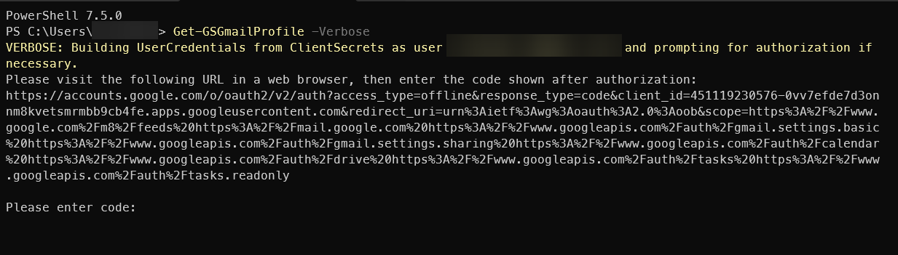
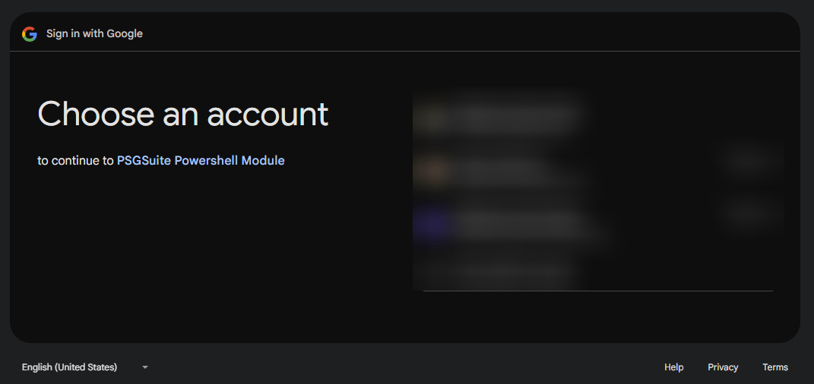
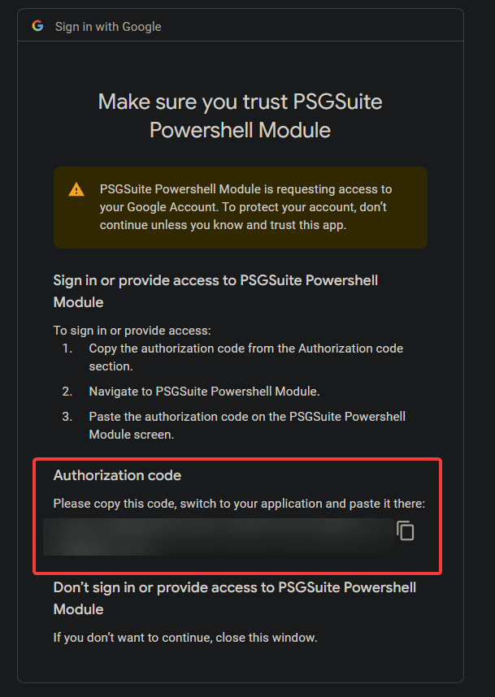
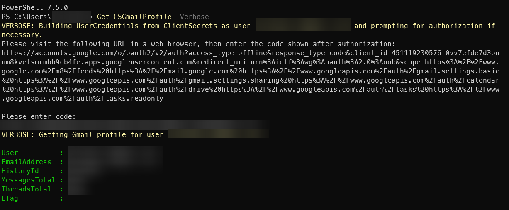
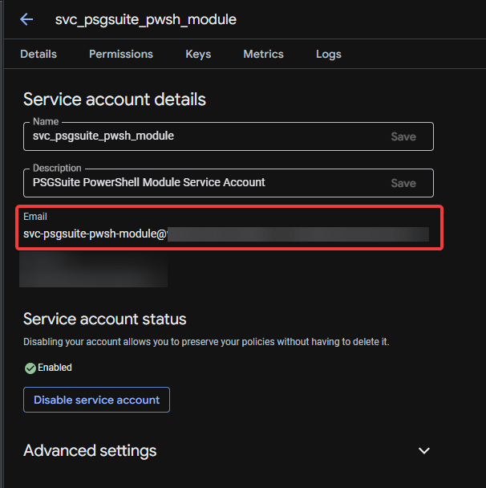
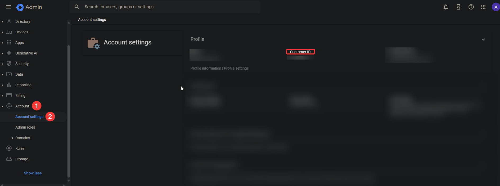

# Configuring the PSGSuite Configuration File

You will need certain information to configure the PSGSuite configuration file. Depending on the credential type you are using, please click the appropriate link below to collect the information you need before configuring the module.

<!-- no toc -->
- [OAuth 2.0 Client ID](#oauth-20-client-id)
- [Service Account](#service-account)

***

## Import PSGSuite Module

1. Import the module to your PowerShell session:
    1. If the module is located in your `$PSModulePath`

        ```powershell {linenums="1"}
        Import-Module PSGSuite -Verbose
        ```

    1. If the module is located in a different path, use the `-Path` parameter:

        ```powershell {linenums="1"}
        Import-Module -Path 'C:\Path\To\PSGSuite\PSGSuite.psd1' -Verbose
        ```

## OAuth 2.0 Client ID

In your Powershell session, create the following variables with the requested information:

1. `$clientSecretsPath`: Path to the OAuth 2.0 JSON file you downloaded previously, e.g. `C:\Path\To\OAuth.json`.
1. `$adminEmail`: Your email.

```powershell {linenums="1"}
$params = @{
    ConfigName = 'PersonalGoogle'
    ClientSecretsPath  = $clientSecretsPath
    AdminEmail = $adminEmail
    }

Set-PSGSuiteConfig @params
```

### First Time Authentication

When using OAuth Client ID, must also complete OAuth in browser to finalize your configuration. This step will generate your `refresh_token` and initial `access_token` for the scopes listed below.

```plaintext {linenums="1"}
    https://mail.google.com/,
    https://mail.google.com/,
    https://www.googleapis.com/auth/calendar,
    https://www.googleapis.com/auth/drive,
    https://www.googleapis.com/auth/gmail.settings.basic,
    https://www.googleapis.com/auth/gmail.settings.sharing,
    https://www.googleapis.com/auth/tasks,
    https://www.googleapis.com/auth/tasks.readonly,
    https://www.googleapis.com/auth/userinfo.email,
    https://www.googleapis.com/auth/userinfo.profile
```

Run the following command to start the authentication process:

```powershell {linenums="1"}
    # We are just running a random cmdlet to force the authentication process to start.
    Get-GSGmailProfile -Verbose
```

After running the above command, if you are using Powershell 6.0 or later:

1. Click on the link in the console output to open a browser window.
    
1. On the `Choose an account` page, select the appropriate account.
    

!!! info
    If you are using an `External` application that is set to `Testing` you might see a message similar to the following:

    ```plaintext
    Google hasn’t verified this app

    You’ve been given access to an app that’s currently being tested.

    You should only continue if you know the developer that invited you.
    ```

1. On the next page, you will be asked to allow the application to access your data.
    1. Place a checkmark next to `Select All`
    1. Click `Continue`

    

1. On the next page, you will see your authorization code you need to enter in the console window.

    

1. If the authentication was successful, your Powershell console should look similar to the following:

    

***

## Service Account

In your Powershell session, create the following variables with the requested information:

1. `$p12KeyPath`: Path to P12 Key File you downloaded previously, e.g. `C:\Path\To\Key.p12`.
1. `$appEmail`: Service Account Email Address
    - Navigate to [Credentials](https://console.cloud.google.com/apis/credentials)
    - Click on the the service account you created.
    - Copy the value under 'Email'
    
1. `$adminEmail`: This is email address for the SuperAdmin account that created the project (usually your email)
1. (Optional) `$customerId`: This is the customer ID associated with your Google Workspace account.
    - Navigate to the [Google Workspace Account Settings](https://admin.google.com/ac/accountsettings/profile)
    
1. `$domain`: This is the domain name associated with your Google Workspace account.
1. `$preference`: This is referenced by certain functions that allow either the Customer ID or Domain to be queried against. You can choose between "CustomerID" or "Domain" for this value.
1. `$serviceAccountClientId`: This will store the service account client ID in the configuration file and it is purely a convenience parameter. The service account client ID is what you copied on Step 2 when you were setting up [Domain Wide Delegation](../getting_started/google_cloud_configuration.md/#domain-wide-delegation)

Run the following command to create the configuration file:

```powershell {linenums="1"}
$params = @{
    AdminEmail = $adminEmail
    AppEmail = $appEmail
    ConfigName = 'GoogleWorkspace'
    CustomerID = $customerID
    Domain = $domain
    P12KeyPath = $p12KeyPath
    Preference = $preference
    ServiceAccountClientID = $serviceAccountClientID
    SetAsDefaultConfig = $true
}
Set-PSGSuiteConfig @params
```

## Multiple Configurations At Once

If you wanted to configure multiple configurations at once, i.e., one for your personal account and one for your work account, you can do so by following the example below:

```powershell {linenums="1"}
@(
    @{
        AdminEmail             = $googleWorkspaceAdminEmail
        AppEmail               = $appEmail
        ConfigName             = 'GoogleWorkspace'
        CustomerID             = $customerID
        Domain                 = $domain
        P12KeyPath             = $p12KeyPath
        Preference             = $preference
        ServiceAccountClientID = $serviceAccountClientID
        SetAsDefaultConfig     = $true
    }
    @{
        ConfigName        = 'PersonalGoogle'
        ClientSecretsPath = $clientSecretsPath
        AdminEmail        = $gmailEmail
    }
) | ForEach-Object {
    $props = $_
    Set-PSGSuiteConfig @props
}
```

## Configuration File Location

The configuration file is located in `$env:LOCALAPPDATA\powershell\SCRT HQ\PSGSuite\Configuration.psd1`.
